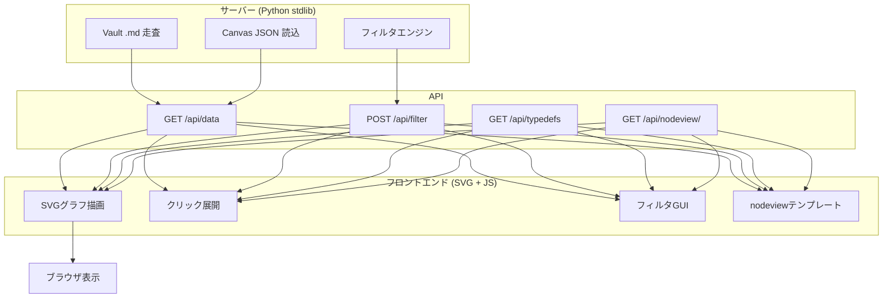

# Canvas Viewer 技術仕様

## 1. 概要

Canvas Generatorで生成された `.canvas` ファイルをブラウザ上でインタラクティブに表示するHTTPサーバーベースのビューアーシステムの技術仕様を示す。Pythonのstdlibのみで動作するHTTPサーバーがVaultデータとCanvas JSONを読み込み、軽量なHTML/CSS/JSフロントエンドにAPI経由でデータを提供する。フロントエンドはSVGによるグラフ描画、クリック展開、フィルタGUIを備える。



## 2. アーキテクチャ

### 2.1 サーバー/クライアント分離

フィルタ・ソート・剪定の全ロジックはサーバー側（Python）で実行される。フロントエンドは純粋な描画とUI操作のみを担当する。これにより、Python側の `filter_sort.py` と同一のロジックをJSに移植する必要がなく、保守性とデバッグ容易性が確保される。

### 2.2 ファイル構成

```
canvas_gen/viewer/
├── server.py        # HTTPサーバー (stdlib http.server)
├── index.html       # HTMLスケルトン (Sidebar + graph領域)
├── viewer.css       # 全スタイル定義
├── viewer.js        # SVG描画・展開・フィルタGUIロジック
└── __init__.py      # パッケージ宣言

viewer_env/           # 独立起動環境
├── start.bat        # Windows起動スクリプト
├── start.ps1        # PowerShell起動スクリプト
└── README.md        # 使用手順

vault/nodeview/       # ノード描画テンプレート (Vault内)
├── plain.json
├── character_card.json
├── scenario_card.json
├── event_card.json
├── era_circle.json
└── tag_bubble.json
```

### 2.3 起動方式

```bash
# デフォルトVaultで起動
cd viewer_env && start.bat

# 任意のVault + Canvas + Port
python -m canvas_gen.main --vault "path/to/vault" \
    --serve-viewer "path/to/timeline.canvas:8765"

# ブラウザで http://127.0.0.1:8765/ を開く
```

## 3. API仕様

### 3.1 GET /api/data

Canvasの全ノード・全エッジとVault全記事のfrontmatter・本文を返す。

```json
{
  "nodes": [{"id":"主人公","type":"file","file":"character/主人公.md","x":0,"y":0,"width":160,"height":120,"color":"#2196F3"}, ...],
  "edges": [{"id":"...","fromNode":"主人公","toNode":"賢者","label":"師弟","color":"#FF9800"}, ...],
  "vault": {
    "主人公": {"file":"character/主人公.md","props":{"type":"character","title":"主人公","ally":["騎士団長"]},"body":"# 主人公\n\n王国の騎士見習い..."},
    ...
  }
}
```

### 3.2 POST /api/filter

フィルタ・ソート・剪定パラメータを受け取り、処理後のノード・エッジを返す。

**Request**:
```json
{
  "filter": "type=character",
  "exclude": "tags=human",
  "sortKey": "title",
  "sortDesc": false,
  "prune": true
}
```

**Response**: `/api/data` と同形式の `{nodes, edges}`。

フィルタ文字列は `key=value` 形式。`|` でOR、`,` でAND。wiki-link正規化マッチ対応。

### 3.3 GET /api/typedefs

Vaultの `_types/type_definitions.yml` をJSONとして返す。nodeview名の参照に使用。

### 3.4 GET /api/nodeview/{name}.json

Vaultの `nodeview/{name}.json` を返す。ノード描画テンプレート。

## 4. フロントエンド機能

### 4.1 SVGグラフ描画

- Canvas JSONの `x`, `y`, `width`, `height` をそのままSVG座標にマッピング
- ノード: `<rect>` 要素。nodeviewテンプレートで形状（rect/round/circle）・rx・色を制御
- エッジ: `<path>` 要素。二次ベジェ曲線。ラベル・色をJSONから取得
- viewBoxによる全体スケーリング。`preserveAspectRatio="xMidYMid meet"`

### 4.2 パン/ズーム

| 操作 | 動作 |
|---|---|
| ドラッグ (空領域) | 全体パン（translate移動） |
| マウスホイール | ズームイン/アウト（10%〜500%） |
| ズーム表示 | 左下に現在倍率を表示 |

パン・ズームはSVGの `<g>` 要素に `transform="translate(x,y) scale(z)"` を適用して実現。フィルタ適用（Apply）後も位置・倍率を維持。Reset時のみ初期化。

### 4.3 クリック展開（in-place）

ノードをクリックすると、その場で矩形が拡大し本文を表示する。

- **展開サイズ**: 本文の実測値から動的計算（`measureText()` で全行の最大幅と総高さを測定）
- **下限サイズ**: nodeviewの `layout.expandMinW` / `expandMinH` で指定（デフォルト300×200）
- **矩形形状**: 展開時はnodeviewの `shape` に従う。`circle` はpill型（横幅≧縦幅）を維持
- **Wrap/Stretch mode**: サイドバーで切替。Wrapは折り返し、Stretchは最長行まで拡張。
- **タイトル非表示**: 展開中は全 `.node-title` 要素を `opacity:0` で非表示
- **近隣ノード変位**: 展開矩形と重なるノードを右方向にシフト（rect + title同時移動）
- **折りたたみ**: 再度クリックで元のサイズに戻り、近隣ノードも元の位置に復帰（差分計算）
- **円形展開**: テキスト位置は `layoutParams(shape=circle)` で直径からcontent領域を計算

### 4.4 フィルタGUI

右サイドバーでフィルタ・ソート・剪定を設定。

| 項目 | UI | 説明 |
|---|---|---|
| Filter | 動的行追加 | key選択 + value入力。複数行でAND |
| Exclude | 同上 | 除外条件 |
| Sort | key選択 + descチェック | ソートキー |
| Prune | チェックボックス | 孤立ノード除去 |
| Apply | ボタン | サーバーにPOSTし再描画 |
| Reset | ボタン | 全初期化 + 位置リセット |

key選択ドロップダウンはVault内の全プロパティ名から自動生成される。

### 4.5 展開時の本文表示

ノード展開時、以下をSVGテキストとして描画：

| 要素 | スタイル |
|---|---|
| タイトル (`props.title`) | 14px, `#e94560`, bold |
| 一般プロパティ | 10px, `#ddd` |
| Pills (後述) | 9px, 背景付きバッジ |
| Markdown見出し | 14px, `#e94560` |
| Markdown引用 | 10px, `#aaa` |
| Markdown本文 | 10px, `#ddd` |
| コードブロック | スキップ（非表示） |

## 5. nodeviewテンプレート

### 5.1 概要

`vault/nodeview/*.json` に配置するJSONファイル。type定義の `nodeview` キーで参照される。ノードの視覚スタイルをtype単位で完全分離する。

### 5.2 スキーマ

```json
{
  "shape": "rect|round|circle",   // 基本形状。展開時も維持される
  "rx": 4,                         // 角丸半径 (round=18, circle=min(w,h)/2)
  "stroke": "#fff6",               // 枠線色
  "strokeWidth": 0.5,              // 枠線幅
  "fontSize": 12,                  // タイトル文字サイズ
  "boldTitle": false,              // タイトル太字
  "titleY": "center|top",          // タイトル垂直位置
  "titlePad": 6,                   // タイトル余白（非推奨、layout内を使用）
  "titleWrap": false,              // タイトル折り返し（circle用）
  "layout": {                      // レイアウトパラメータ（全形状共通）
    "contentPadX": 8,              // 本文・タイトルの横パディング
    "contentPadY": 8,              // 本文の縦パディング（展開時に使用）
    "titlePadX": 10,               // タイトル横パディング
    "titlePadY": 10,               // タイトル縦パディング（縮小時に使用）
    "expandMinW": 300,             // 展開時の最小横幅
    "expandMinH": 200              // 展開時の最小縦幅
  },
  "properties": {                  // プロパティ別pill設定
    "タグ名": {
      "style": "pill",
      "shape": "round|diamond",
      "bg": "#4CAF5044",
      "textColor": "#8BC34A"
    }
  }
}
```

**layoutパラメータの適用**:

| パラメータ | 縮小時 | 展開時 |
|---|---|---|
| `contentPadX` | タイトル折り返し幅の計算に使用 | 本文の左余白 |
| `contentPadY` | 不使用 | 本文の上余白 |
| `titlePadX` | タイトル左余白 | 不使用（タイトルは非表示） |
| `titlePadY` | 折り返しタイトルの上下余白 | 不使用 |
| `expandMinW/H` | 不使用 | 展開サイズの下限 |

### 5.3 定義例

**character_card.json**: 全リレーション種別（ally, rival, likes, dislikes, mentor, family, affiliation）が色分けpill

**tag_bubble.json**: shape=round, rx=18。丸っこいタグ表示

**era_circle.json**: shape=circle, titleWrap=true。円形に時代名を折り返し表示

**event_card.json**: titleY=top。タグ・関連がpill表示

**plain.json**: 標準的な角丸矩形。全プロパティがテキスト表示

### 5.4 Pill表示ロジック

`properties` に `style: "pill"` が指定されたプロパティは、展開時に以下のように描画される：

1. 値から `[[...]]` のwiki-link括弧を除去
2. 各値を個別のバッジ（`<rect>` + `<text>`）として描画
3. バッジは左から右にフロー配置、矩形幅を超えると次の行へ
4. バッジ間隔 6px、行間隔はフォントサイズ+余白で自動計算

## 6. フィルタエンジン（サーバー側）

### 6.1 評価ルール

`canvas_gen/filter_sort.py` と同一ロジック：

- キー間 **AND** 評価
- 同一キー複数値 **OR** 評価
- `$or` ネスト対応（クロスキーOR）
- wiki-link正規化マッチ（`human` ↔ `[[human]]`）
- リスト値メンバーシップ検査

### 6.2 フィルタ文字列構文

```
type=character              # 単一条件
type=character|tag          # OR (|)
type=character,tags=main    # AND (,)
tags=human                  # wiki-link正規化マッチ
```

### 6.3 剪定（prune）

- エッジを1本も持たないノードをcanvasから除去
- `--prune-orphans` フラグに相当
- type指定による対象限定は未実装（サーバー側拡張可能）

## 7. サーバー実装詳細

### 7.1 使用ライブラリ

Python標準ライブラリのみ（`http.server`, `json`, `pathlib`, `yaml`（PyYAML））。

### 7.2 データ読み込み

起動時に以下を一括ロード：

1. Canvas JSON → `FILE_NODES`（`_icon` サフィックスを除外したノード）, `ALL_EDGES`
2. Vault内全 `.md` ファイル → `VAULT_CONTENT`（frontmatter + 本文）
3. `_types/type_definitions.yml` → API経由でフロントエンドへ

### 7.3 エンドポイント一覧

| Method | Path | 説明 |
|---|---|---|
| GET | `/` | index.html |
| GET | `/viewer.css` | スタイルシート |
| GET | `/viewer.js` | JavaScript |
| GET | `/api/data` | Canvas+Vaultフルデータ |
| POST | `/api/filter` | フィルタ実行 |
| GET | `/api/typedefs` | type定義 |
| GET | `/api/nodeview/{name}.json` | nodeviewテンプレート |

## 8. 拡張性

### 8.1 新規nodeview追加

1. `vault/nodeview/新テンプレート.json` を作成
2. `_types/type_definitions.yml` の該当typeに `nodeview: 新テンプレート` を追加
3. フロントエンドは起動時に全nodeviewを自動ロードするため再起動のみで反映

### 8.2 プロパティpill追加

nodeview JSONの `properties` に新しいキーを追加するだけで、展開時の描画が自動的にpill形式に切り替わる。サーバー側・JSロジックの変更は不要。

### 8.3 フィルタ拡張

サーバー側の `run_filter()` 関数に新しいフィルタ条件を追加することで、GUI側も自動的に対応する（key選択ドロップダウンがVaultの全プロパティを動的走査するため）。

### 8.4 レイアウトエンジン（layoutParams）

ノードの描画位置計算は `layoutParams(nv, nw, nh)` 関数に集約されている。nodeview JSONの `shape` と `layout` ブロックのみから全パラメータを算出し、ビューアコード内にハードコードされた形状分岐は存在しない。

**計算アルゴリズム**:

1. `shape` が `circle` の場合、`diameter = min(nw, nh)` で直径を決定し、content領域を直径からパディングを引いた矩形として計算する
2. `shape` が `rect` / `round` の場合、`nw × nh` 全体からパディングを引いた矩形をcontent領域とする
3. タイトルアンカー（`titleAnchor`）と垂直位置（`titleVAlign`）を形状に応じて設定
4. 円形では `text-anchor: middle` で中央揃え、矩形では `start` で左揃え

### 8.5 縮小時タイトル描画

縮小時のノードタイトルは以下のルールで描画される：

| 条件 | 描画方式 |
|---|---|
| `titleWrap: false` | 単一行テキスト。`titleAnchor` に従い配置。横幅超過時は末尾を `..` に短縮 |
| `titleWrap: true` | 複数行折り返し。`contentW` 幅で折り返し、タイトルブロック全体を `titleY` を中心に縦方向センタリング |

折り返しタイトル（`drawWrappedTitle`）では、`titleY` を縦方向の中心軸とし、全行の合計高さを計算して `titleY - blockH/2` から描画を開始する。`contentH` による縦方向制限は行わない（縮小時の狭い円形で内容が切れることを防止するため）。

### 8.6 展開時サイズ計算

展開時の矩形サイズは、本文の実測値から動的に計算される。ハードコードされた固定値は使用しない。

1. `buildBodyLines()` で本文行を構築
2. 各行を `measureText()` で実測し `maxLineW`（最大行幅）と `lineH`（総行高）を算出
3. pillバッジ行も個別のテキスト幅＋余白を加味して合計幅を計算
4. `expandMinW` / `expandMinH` を下限として `expW = max(minW, maxLineW + cpX*2 + 16)` で幅を決定
5. 円形形状では `diameter >= max(neededW, neededH)` を保証し、テキストが直径内に収まることを担保
6. 最終サイズで `layoutParams` を再計算し、正確なcontent座標を取得

### 8.7 近隣ノード変位

展開時に展開矩形と重なる近隣ノードは、以下のロジックで右方向にシフトされる：

1. 展開矩形 `(nx, ny, expW, expH)` と他ノード `(ox, oy, ow, oh)` の重なりを判定
2. 重なりがある場合、`shift = (nx + expW) - ox + 20` で変位量を計算
3. ノードの rect と全 `.node-title` 要素を同時にシフト
4. 折りたたみ時（`collapseAll`）は差分 `origX - curX` を計算し全要素を元の位置に復元

## 9. 結論

本ビューアーは、Canvas Generatorで生成されたJSON Canvasファイルを、サーバー/クライアント分離アーキテクチャによってブラウザ上でインタラクティブに表示する。フィルタ・ソートロジックをPython側に集約することでJS移植の必要を排除し、nodeviewテンプレートによってtype別・プロパティ別の描画スタイルを完全に外部化した。展開サイズは本文の実測値から動的に計算され、円形・矩形を問わずテキストが形状内部に収まる。標準ライブラリのみで動作し、VaultとCanvasファイルさえあれば単一コマンドで起動できる。
